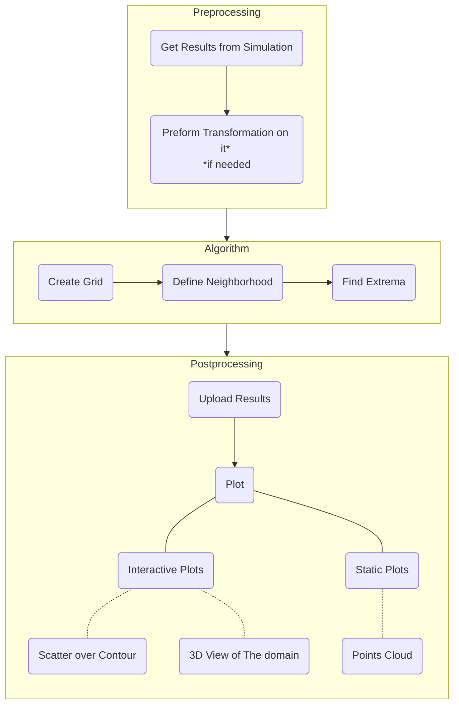

# Extrema Analysis FlowChart

```mermaid
flowchart TB
    pre --> algo --> post

    subgraph pre[Preprocessing]
        direction TB
        
        get(Get Results from Simulation) --> transf(Preform Transformation on it* \n*if needed)
    end

    subgraph algo[Algorithm]
        direction LR
        inst1(Create Grid) --> inst2(Define Neighborhood)
        inst2 --> inst3(Find Extrema)
    end

    subgraph post[Postprocessing]
        direction TB
        upload(Upload Results) --> plot(Plot)
        plot --- interactive(Interactive Plots)
        plot --- static(Static Plots)
        interactive -.- scatter(Scatter over Contour)
        interactive -.- 3d(3D View of The domain)        
        static -.- points-cloud(Points Cloud)
    end
```