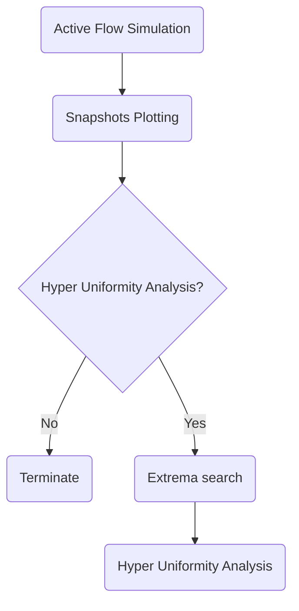
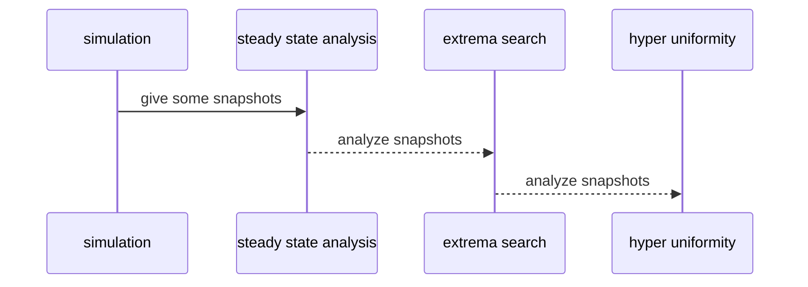
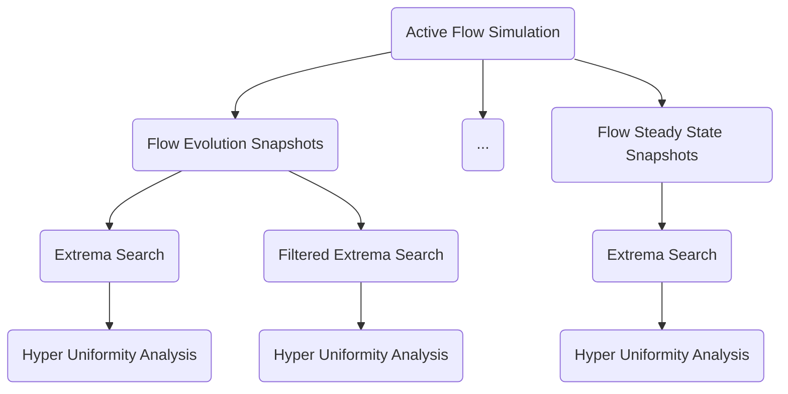

# Simulation Experiment Pipeline

## Flow Chart

```mermaid
flowchart TB
    simulation(Active Flow Simulation) --> snapshots(Snapshots Plotting)
    snapshots --> flow{Hyper Uniformity Analysis?}
    flow --> |No| terminate(Terminate)
    flow --> |Yes| extrema(Extrema search)
    extrema --> hyper(Hyper Uniformity Analysis)
```

## Sequence Diagram

```mermaid
sequenceDiagram
    participant simulation
    participant steady state analysis
    participant extrema search
    participant hyper uniformity
    simulation->>steady state analysis: give some snapshots
    steady state analysis-->>extrema search: analyze snapshots
    extrema search-->>hyper uniformity: analyze snapshots
```

## Use Case

```mermaid
flowchart TB
    simulation(Active Flow Simulation) --> evolution(Flow Evolution Snapshots)
    simulation --> placeholder(...)
    simulation --> steady(Flow Steady State Snapshots)
    evolution --> evolution-extrema(Extrema Search)
    evolution --> filtered-evolution-extrema(Filtered Extrema Search)
    steady --> steady-extrema(Extrema Search)
    evolution-extrema --> evolution-hyper(Hyper Uniformity Analysis)
    filtered-evolution-extrema --> filtered-evolution-hyper(Hyper Uniformity Analysis)
    steady-extrema --> steady-hyper(Hyper Uniformity Analysis)
```
