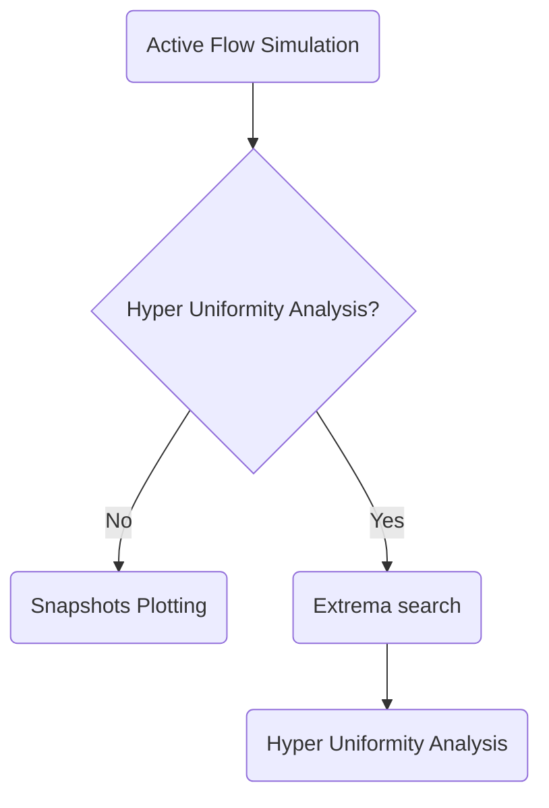
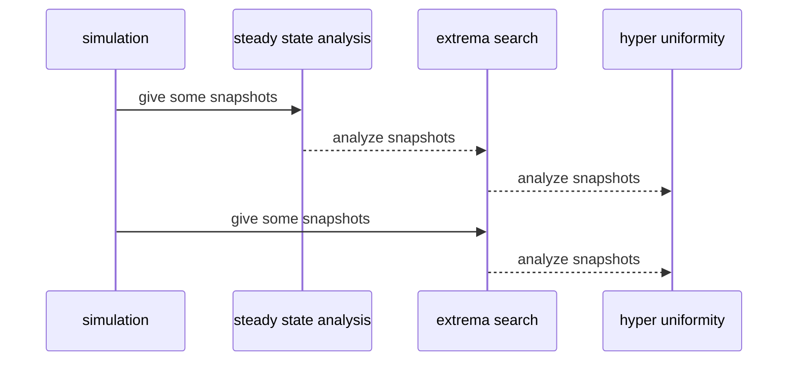

# Simulation Experiment Pipeline

## Flow Chart

```mermaid 
flowchart TB
    simulation(Active Flow Simulation) --> flow{Hyper Uniformity Analysis?}
    flow --> |No| snapshots(Snapshots Plotting)
    flow --> |Yes| extrema(Extrema search)
    extrema --> hyper(Hyper Uniformity Analysis)
```

## Sequence Diagram

```mermaid
sequenceDiagram
    participant simulation
    participant steady state analysis
    participant extrema search
    participant hyper uniformity
    simulation->>steady state analysis: give some snapshots
    steady state analysis-->>extrema search: analyze snapshots
    extrema search-->>hyper uniformity: analyze snapshots
    simulation->>extrema search: give some snapshots
    extrema search-->>hyper uniformity: analyze snapshots
```