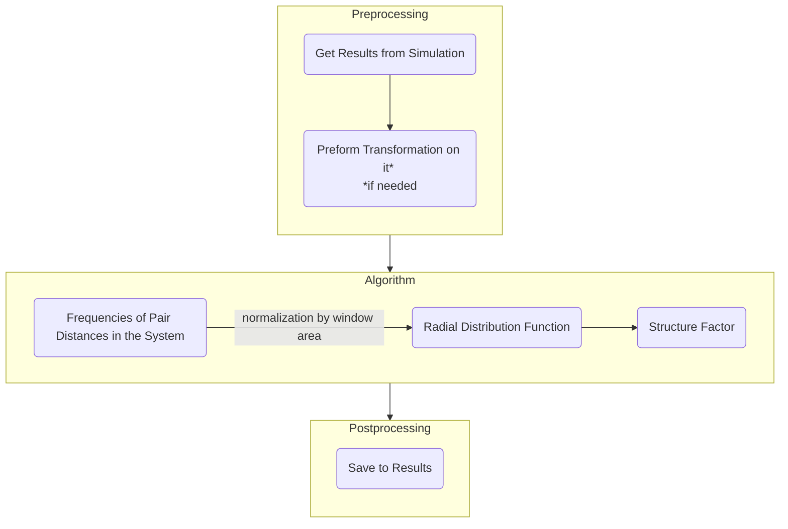

# Hyperuniformity Checking FlowChart

```mermaid
flowchart TB
    pre --> algo --> post

    subgraph pre[Preprocessing]
        direction TB
        
        get(Get Results from Simulation) --> transf(Preform Transformation on it* \n*if needed)
    end

    subgraph algo[Algorithm]
        direction LR
        inst1(Frequencies of Pair Distances in the System) -->|normalization by window area| inst2(Radial Distribution Function)
        inst2 --> inst3(Structure Factor)
    end

    subgraph post[Postprocessing]
        direction TB
        save(Save to Results) 
    end
```