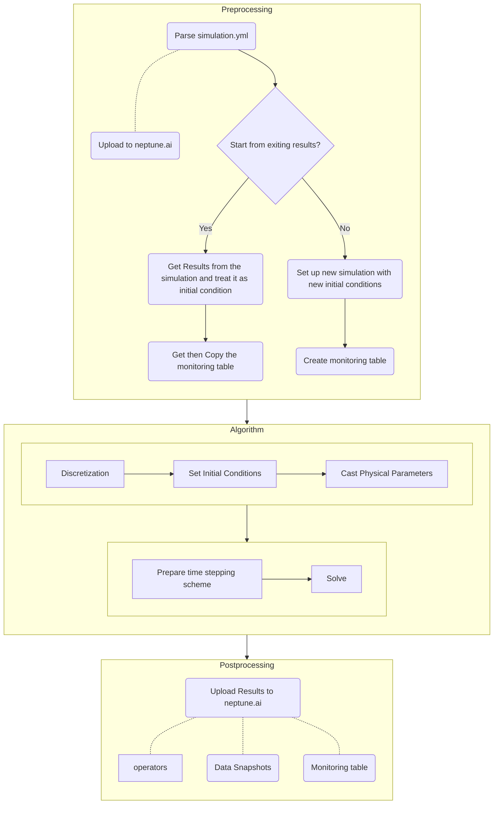

# Simulation FlowChart

```mermaid
flowchart TB
    pre --> algo --> post

    subgraph pre[Preprocessing \n]
        direction TB

        parse(Parse simulation.yml) -.- upload(Upload to neptune.ai)
        parse(Parse simulation.yml)--> seed{Start from exiting results?}
        seed -->|Yes| get(Get Results from the simulation and treat it as initial condition)
        get --> copy-monitor(Get then Copy the monitoring table)
        seed -->|No| init(Set up new simulation with new initial conditions)
        init --> create-monitor(Create monitoring table)
    end

    subgraph algo[Algorithm\n]
        direction TB

        subgraph section1[ ]
            direction LR
            inst1[Discretization] --> inst2[Set Initial Conditions]
            inst2 --> inst3[Cast Physical Parameters]
        end

        subgraph section2[ ]
            direction LR
            inst4[Prepare time stepping scheme] --> inst5[Solve]
        end

        section1 --> section2
    end

    subgraph post[Postprocessing]
        direction TB
        save(Upload Results to neptune.ai) -.- operators
        save -.- snapshots(Data Snapshots)
        save -.- save-table(Monitoring table) 
    end
```

Metadata uploaded neptune.ai:
* Simulation Parameter "Only related to Algorithm"
* Operators (Discretization data structures)
* Data Snapshots
* Monitoring table

