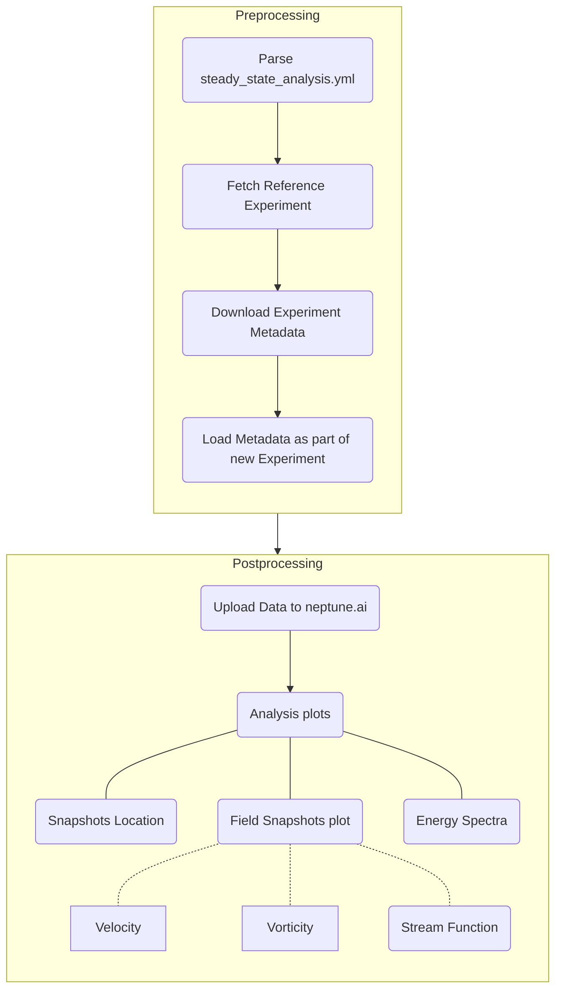

# Steady State Analysis FlowChart

```mermaid
flowchart TB
    pre --> post

    subgraph pre[Preprocessing \n]
        direction TB

        parse(Parse steady_state_analysis.yml) --> fetch(Fetch Reference Experiment)
        fetch --> download(Download Experiment Metadata)
        download --> load(Load Metadata as part of new Experiment)
    end


    subgraph post[Postprocessing]
        direction TB

        upload(Upload Data to neptune.ai) --> plot(Analysis plots)
        plot --- location(Snapshots Location)
        plot --- field(Field Snapshots plot)
        field -.- Velocity
        field -.- Vorticity
        field -.- stream(Stream Function)
        plot --- spectra(Energy Spectra)
    end
```